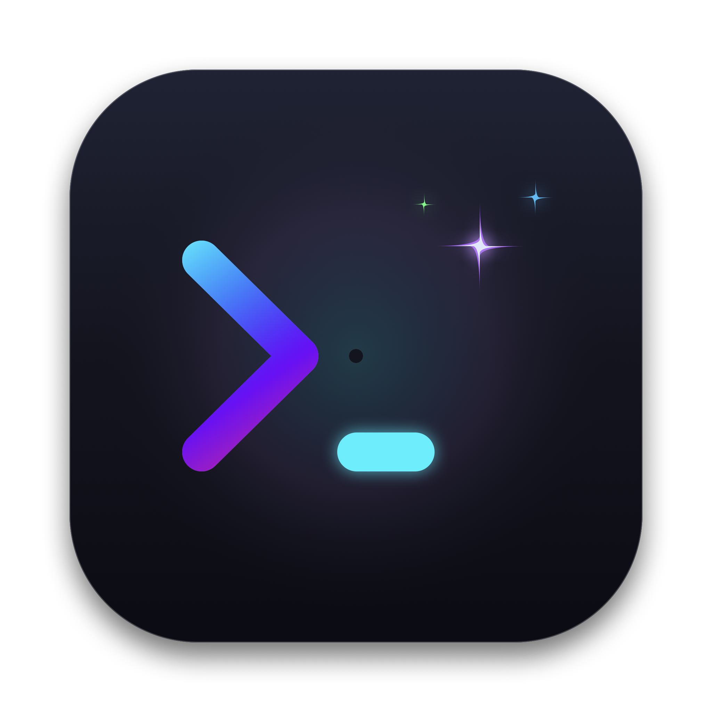

# AIConsole 🚀

<div align="center">
  
  <h3>专为 macOS 打造的高性能原生 AI 智能终端与运维工作台</h3>
  <p>集成 SSH / 串口 / VNC / FTP 多协议 • 内置 AI 极速根因诊断 • Touch ID 生物防护</p>

  <p>
    <a href="https://github.com"></a>
    <a href="https://swift.org"></a>
    <a href="LICENSE"></a>
    <a href="https://aiconsole.bin0sky.tech"></a>
  </p>
</div>

---

## 🌟 核心特性 (Key Features)

- **⚡ 全协议集成**：
  - **SSH / Telnet**：原生伪终端驱动，支持密钥/密码快速连接与心跳保活。
  - **USB 硬件串口 (Serial)**：基于底层 `IOKit` 驱动监听，支持 CH340 / CP2102 / FTDI 串口热插拔与波特率精细调校。
  - **VNC 远程桌面**：直连图形化服务器。
  - **FTP 文件管理**：双向文件传输与目录浏览。
- **🤖 AI 故障诊断助手 (AI Copilot)**：
  - 自动识别终端报错堆栈。
  - 极速三段式诊断卡片：根因定位、极速修复命令、风险提示。
  - 支持一键将修复命令回填至终端执行。
  - 支持自由配置任何兼容 OpenAI 协议的模型（DeepSeek、OpenAI、Claude、Gemini、本地 Ollama 等）。
- **🔒 军工级安全体系**：
  - **Touch ID / 生物认证**：保护敏感会话与密码读取。
  - **Keychain 凭证隔离**：所有密钥在本地安全钥匙串加密存储，绝不上云。
  - **高危命令拦截 Guard**：实时识别并二次确认 `rm -rf /`、`mkfs`、`dd` 等破坏性危险操作。
- **🎨 极致桌面体验**：
  - 基于 GPU 渲染的低延迟终端。
  - 水平与垂直无缝分屏工作区。
  - 极客主题切换与常用代码片段库。

---

## 🛠️ 本地编译与运行 (Build & Run)

### 系统要求
- macOS 14.0 (Sonoma) 或更高版本
- Xcode 15.0+ 或 Swift 5.9+ 工具链

### 1. 开发调试运行
```bash
cd AIConsole
swift run
```

### 2. 生产打包 (生成 .app、.dmg 与 .zip)
项目中内置了自动化打包与镜像制作脚本：
```bash
cd AIConsole
./scripts/package-app.sh
```
执行完成后，将在 `AIConsole/dist/` 目录下生成：
- `AIConsole.app` (macOS 应用程序包，已注入元信息与签名)
- `AIConsole-macOS.dmg` (标准拖拽安装镜像)
- `AIConsole-macOS.zip` (绿色便携压缩包)

---

## 🌐 部署 Cloudflare Pages 产品官网

本项目提供了一个开箱即用的静态官网，位于 `web/` 目录：
1. 访问 [Cloudflare Dashboard](https://dash.cloudflare.com/) ➔ 进入 **Workers & Pages** ➔ **Create application** ➔ **Pages**。
2. 连接 GitHub 仓库或直接上传 `web/` 文件夹。
3. 自定义域名绑定为例如 `aiconsole.bin0sky.tech`。
4. 官网已内置炫酷深色极客设计、多协议特性展示与直链下载按钮。

---

## 📁 目录结构 (Repository Structure)

```text
├── AIConsole/                   # Swift 原生桌面端工程
│   ├── Package.swift            # SPM 依赖描述 (SwiftTerm 等)
│   ├── Sources/AIConsoleApp/    # 源代码目录
│   │   ├── Models/              # 会话、主题、安全配置等数据模型
│   │   ├── Services/            # AI、串口、SSH、TouchID 等服务层
│   │   └── Views/               # SwiftUI + AppKit 界面交互层
│   ├── scripts/
│   │   └── package-app.sh       # 一键 Release 编译与 DMG 打包脚本
│   └── dist/                    # 打包产物 (已加入 .gitignore)
├── web/                         # Cloudflare Pages 静态官网落地页
│   ├── index.html               # 极客风格官网主页
│   └── AppIcon.png              # 官网图标与 Favicon
├── .gitignore                   # Git 忽略配置
└── README.md                    # 本项目文档说明
```

---

## 📄 开源许可证 (License)

本项目采用 [MIT License](LICENSE) 开源协议。
